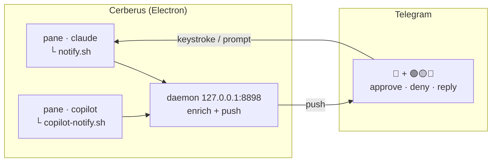

<div align="center">


**A GUI terminal multiplexer with remote control** — split panes with the mouse or tmux-style keys, and approve, deny, or prompt Claude Code &amp; GitHub Copilot CLI from your phone, over Telegram, straight into the right pane.

<sub>native panes · no tmux · permission prompts · risk-tagged commands · multi-account · session restore · light/dark</sub>


[Download](#download) · [First run](#first-run) · [Controls](#controls) · [Config](#per-project-config) · [Development](#development) · [Orchestration](#experimental-orchestration-cockpit)

</div>

> Your company won't enable remote control? No problem — Cerberus is your
> three-headed guard dog, and it works the night shift for free. 🐕‍🦺

Run your AI coding sessions in native panes — no tmux, every pane is a pty
Cerberus owns. When a session needs you — a permission prompt, waiting for input
— it pushes a Telegram notification. From your phone you **approve / deny**, or
**type a prompt** that lands in the right pane. Every pending command is tagged
with a risk icon 🟢 🟡 🔴 so you know what you're approving. Approve something
remotely and the result is pushed back to you.



## Download

Grab the installer for your OS from the latest release:

| OS | File |
|----|------|
| macOS (Apple Silicon) | [`Cerberus-mac-arm64.dmg`](https://github.com/leodudedev/cerberus-term/releases/latest/download/Cerberus-mac-arm64.dmg) |
| Windows | [`Cerberus-win-x64.exe`](https://github.com/leodudedev/cerberus-term/releases/latest/download/Cerberus-win-x64.exe) |
| Linux (AppImage) | [`Cerberus-linux-x86_64.AppImage`](https://github.com/leodudedev/cerberus-term/releases/latest/download/Cerberus-linux-x86_64.AppImage) |

Or see all assets on the [releases page](https://github.com/leodudedev/cerberus-term/releases/latest).

> Builds aren't notarized yet. **macOS** flags the app as "damaged" (Gatekeeper
> quarantine on a non-notarized app) — clear it once, then open normally:
> ```bash
> xattr -cr /Applications/Cerberus.app
> ```
> **Windows**: dismiss the SmartScreen prompt. Signing/notarization is on the list.

## First run

1. Open the app.
2. **Cmd+,** (or menu → **Settings…**) → set your Telegram **bot token** and
   **chat ID**. Restart to start polling.
3. In any pane run `claude` (or `copilot`). Cerberus installs the CLI hooks
   silently on first run; when a session needs you, you get a Telegram push with
   🟢 🟡 🔴 risk and Approve / Deny / prompt buttons that land in that pane.

## Controls

| Action | Mouse / button | Keyboard |
|--------|----------------|----------|
| Split right / down | ◧ / ⬓ in the pane header | `Ctrl+B` then `%` / `"` (or Cmd+D / Cmd+Shift+D) |
| Kill pane | ✕ | `Ctrl+B` then `x` (or Cmd+K) |
| Focus pane | click | `Ctrl+B` then `h/j/k/l` or arrows |
| Resize | drag the divider | `Ctrl+B` then `H/J/K/L` |
| Edit `.cerberus.json` | ⚙ | — |
| Settings | menu → Settings… | `Cmd+,` |
| Toggle theme | menu → View → Toggle Theme | `Cmd+Shift+L` |

The layout, per-pane cwds, and theme are restored on relaunch.

## Per-project config

Drop a `.cerberus.json` in a project (edit it via the pane's ⚙ gear) to override
the global settings for sessions running there:

| Key | Meaning |
|-----|---------|
| `mute` | silence notifications for this project |
| `chatId` | route its pushes to a different Telegram chat |
| `minRisk` | only notify at/above this risk (`safe` \| `caution` \| `danger`) |
| `notifyIdle` | also notify on waiting-for-input, not just permissions |

## Development

```bash
pnpm install     # postinstall rebuilds node-pty for the Electron ABI
pnpm dev         # launch the app (HMR)
pnpm typecheck
```

Build installers locally:

```bash
pnpm run dist          # current OS
pnpm run dist:mac      # / dist:win / dist:linux
```

> Use `pnpm run pack`/`dist`, not `pnpm pack`/`dist` — `pack` collides with a
> pnpm builtin.

### Releases

Push a tag and GitHub Actions builds + publishes the installers to a Release:

```bash
git tag v0.1.0 && git push --tags
```

The `build` workflow (`.github/workflows/build.yml`) builds macOS / Windows /
Linux in a matrix.

## Security

The daemon binds **loopback only** (`127.0.0.1`); `POST /pane` requires an
absolute file path and shell-quotes everything it runs. Telegram callbacks are
checked against your allowed chat(s). CLI hooks are gated on `CERBERUS_PANE_ID`,
so they fire only inside a Cerberus pane and coexist with any tmux-based setup.

Your Telegram bot token (`~/.cerberus-term/cerberus-settings.json` — or platform
userData) and the session state (`~/.cerberus-term/cerberus-state.json`) are
stored in **plaintext**, like a `.env`. Anyone with access to your user account
can read them; keep the machine trusted. The loopback daemon is currently
**unauthenticated** — any local process can post events or open follower panes,
so treat it as trusted-local-only.

## Stack

Electron · xterm.js · node-pty · TypeScript · electron-vite · electron-builder ·
grammY (Telegram). The backend sits behind a thin `TerminalBridge` seam, so a
future Tauri/Rust swap is a module replacement, not a rewrite.

## Experimental: orchestration cockpit

> ⚗️ **Early-stage.** The APIs below work but are young and may change — treat
> this as a preview of the tool's second head.

Beyond supervising single sessions, Cerberus can act as a **cockpit for
multi-session orchestration**: one interactive session drives a queue of
headless workers, each worker streams live into a read-only follower pane, and
the human gates (merge/push approvals) still arrive on your phone.

**The model:**

- **Orchestrator** = one *interactive* session (e.g. `claude`) in a Cerberus
  pane. It's the only interactive session, so it's the only one that prompts →
  its sensitive gates (merge, push, deploy) reach **Telegram** and you approve
  from your phone.
- **Workers** = headless runs (`claude -p`, `copilot -p`, aider, any script)
  launched by the orchestrator. They never prompt; they're **muted** so they
  don't spam notifications, and **observable** live in read-only follower panes
  that auto-tile into a grid.

The orchestrator is **agent-agnostic**: each task carries its own worker
command, so you can mix Claude, Copilot, and plain scripts in one queue. The
whole thing also runs *outside* Cerberus (the supervision layer just no-ops).

**Two integration points:**

1. **Mute the workers.** The CLI hooks are gated on `CERBERUS_PANE_ID`, which
   child processes inherit. Launch workers with it unset so only the
   orchestrator notifies:
   ```bash
   env -u CERBERUS_PANE_ID claude -p "…" --output-format stream-json
   ```
2. **Open follower panes.** Ask the daemon (loopback-only) for a read-only pane
   tailing a worker log — best-effort, no-op outside Cerberus:
   ```bash
   curl -fsS -X POST "http://127.0.0.1:$CERBERUS_PORT/pane" \
     -H 'content-type: application/json' \
     -d '{"file":"'$PWD'/out/t1.log","title":"t1","format":"claude-stream"}' || true
   ```
   `CERBERUS_PORT` is injected into every Cerberus pane. `format` is opt-in:
   `"claude-stream"` renders Claude Code stream-json as a readable projection
   (assistant text, `> tool {input}`, a `-- result | turns | cost` footer);
   omit it (or `"raw"`) for a plain `tail -f` of any other agent's log.

**Try it:** [`examples/orchestrate.sh`](examples/orchestrate.sh) is a minimal
agent-agnostic driver — it walks a task queue
([`examples/queue.json`](examples/queue.json)) with per-task `cmd`, dependency
ordering, and persistent `pending → done | blocked` state (crash-resumable),
opening a follower pane per worker:

```bash
cd your-project
cp path/to/examples/{orchestrate.sh,queue.json} .
# edit queue.json: one entry per task, any CLI as "cmd"
./orchestrate.sh
```

For judgment (diff review) on top of mechanics, run an interactive session in a
Cerberus pane (`claude --model opus`), and prompt it to read the queue, drive
the script as its engine, review the outputs, and perform the gated actions —
which land on your phone as Telegram approvals.

## License

MIT — see [LICENSE](LICENSE).
