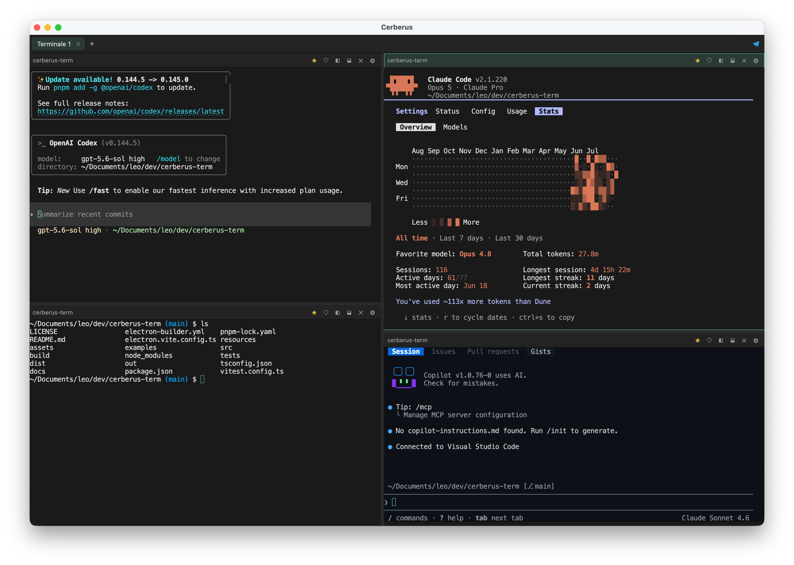
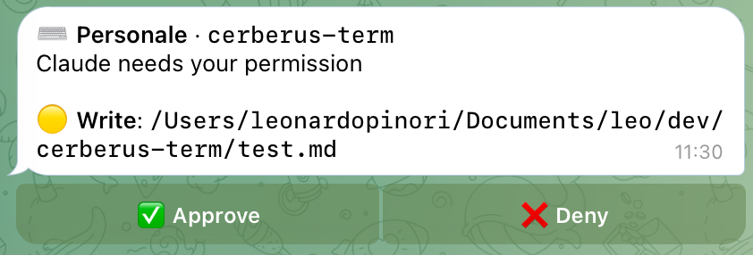
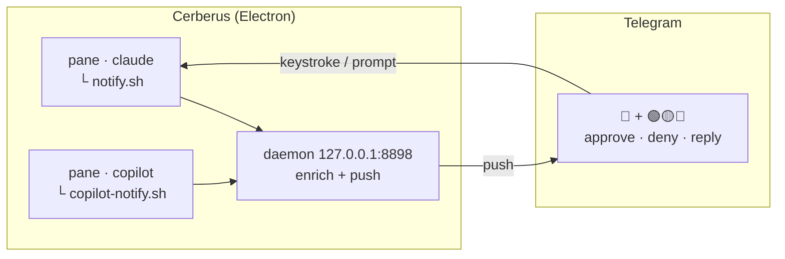

<div align="center">


**A GUI terminal multiplexer with remote control** — split panes with the mouse or tmux-style keys, and approve, deny, or prompt Claude Code, Copilot CLI &amp; friends from your phone, over Telegram, straight into the right pane.

<sub>native panes · no tmux · permission prompts · risk-tagged commands · tabs · session restore · light/dark</sub>


[Download](#download) · [First run](#first-run) · [Controls](#controls) · [From your phone](#from-your-phone) · [Config](#per-project-config) · [Contributing](#contributing)



</div>

> Your company won't enable remote control? No problem — Cerberus is your
> three-headed guard dog, and it works the night shift for free. 🐕‍🦺

Run your AI coding sessions in native panes — no tmux, every pane is a pty
Cerberus owns. When a session needs you — a permission prompt, waiting for input
— it pushes a Telegram notification. From your phone you **approve / deny**, or
**type a prompt** that lands in the right pane. Every pending command is tagged
with a risk icon 🟢 🟡 🔴 so you know what you're approving. Approve something
remotely and the result is pushed back to you.

<div align="center">

</div>


```mermaid
flowchart LR
    subgraph app["Cerberus (Electron)"]
        A["pane · claude<br/>└ notify.sh"]
        B["pane · copilot<br/>└ copilot-notify.sh"]
        D["daemon 127.0.0.1:8898<br/>enrich + push"]
        A --> D
        B --> D
    end
    subgraph tg["Telegram"]
        T["🔔 + 🟢🟡🔴<br/>approve · deny · reply"]
    end
    D -->|push| T
    T -->|"keystroke / prompt"| A
```

## Download

Grab the installer for your OS from the latest release:

| OS | File |
|----|------|
| macOS (Apple Silicon) | [`Cerberus-mac-arm64.dmg`](https://github.com/leodudedev/cerberus-term/releases/latest/download/Cerberus-mac-arm64.dmg) |
| Windows | [`Cerberus-win-x64.exe`](https://github.com/leodudedev/cerberus-term/releases/latest/download/Cerberus-win-x64.exe) |
| Linux (AppImage) | [`Cerberus-linux-x86_64.AppImage`](https://github.com/leodudedev/cerberus-term/releases/latest/download/Cerberus-linux-x86_64.AppImage) |

Or see all assets on the [releases page](https://github.com/leodudedev/cerberus-term/releases/latest).

> Builds aren't notarized yet. **macOS** flags the app as "damaged" (Gatekeeper
> quarantine on a non-notarized app) — clear it once, then open normally:
> ```bash
> xattr -cr /Applications/Cerberus.app
> ```
> **Windows**: dismiss the SmartScreen prompt. Signing/notarization is on the list.

## Requirements

- **macOS, Windows, or Linux.** On Windows the panes run over ConPTY; the shell
  hooks that power notifications are bash-based, so remote control there works
  through WSL.
- **An AI CLI** in your `PATH` — [Claude Code](https://claude.com/claude-code)
  and [GitHub Copilot CLI](https://github.com/github/copilot-cli) get
  notification hooks installed automatically. Any other CLI still runs in a pane;
  it just won't push.
- **A Telegram bot** for the remote half: talk to
  [@BotFather](https://t.me/BotFather) for a token, and to
  [@userinfobot](https://t.me/userinfobot) for your chat ID. Without them
  Cerberus is a plain multiplexer — nothing is pushed anywhere.

## First run

1. Open the app.
2. **Cmd+,** (or menu → **Settings…**) → set your Telegram **bot token** and
   **chat ID**, and pick the bot's language (English or Italian). Restart the app
   so the bot starts polling with the new token.
3. In any pane run `claude` (or `copilot`). Cerberus installs the CLI hooks
   silently on first run; when a session needs you, you get a Telegram push with
   🟢 🟡 🔴 risk and Approve / Deny / prompt buttons that land in that pane.

## Controls

| Action | Mouse / button | Keyboard |
|--------|----------------|----------|
| Split right / down | ◧ / ⬓ in the pane header | `Ctrl+B` then `%` / `"` (or Cmd+D / Cmd+Shift+D) |
| Kill pane | ✕ | `Ctrl+B` then `x` (or Cmd+K) |
| Focus pane | click | `Ctrl+B` then `h/j/k/l` or arrows |
| Resize | drag the divider | `Ctrl+B` then `H/J/K/L` |
| New / close tab | `+` / `✕` in the tab bar | `Cmd+T` / `Cmd+W` |
| Next / previous tab | click the tab | `Cmd+Shift+]` / `Cmd+Shift+[` |
| Star this pane's cwd | ☆ | — |
| Jump to a favorite | ♡ | — |
| Edit `.cerberus.json` | ⚙ | — |
| Mute every Telegram push | ✈ at the right of the tab bar | — |
| Copy / paste | — | `Cmd+C` / `Cmd+V` (`Ctrl+Shift+C` / `Ctrl+Shift+V`) |
| Find in pane | menu → Edit → Find… | `Cmd+F` (`Ctrl+Shift+F`) |
| Newline without submitting | — | `Shift+Enter` |
| Settings | menu → Settings… | `Cmd+,` |
| Toggle theme | menu → View → Toggle Theme | `Cmd+Shift+L` |

Where two keys are listed, the second is Windows/Linux: `Ctrl+C`, `Ctrl+F` and
friends are control characters the shell owns, so those bindings move to
`Ctrl+Shift`. The `Ctrl+B` leader arms for two seconds; Esc cancels it.

Find searches the focused pane's scrollback: Enter and Shift+Enter walk the
matches, `Aa` and `.*` toggle case sensitivity and regex, Esc closes.

Dropping files onto a pane types their absolute paths into the session.

The layout, per-pane cwds, tabs, favorites, and theme are restored on relaunch.
Panes also survive a window reload — the shells keep running and reattach.

### Do not disturb

The ✈ button at the right of the tab bar is a global do-not-disturb: while the
plane shows crossed out, no session pushes to Telegram, so you can work at the
keyboard undisturbed, and one click restores every session at once when you walk
away. Clicking it opens a dialog spelling out what changes and what doesn't — an
icon alone can't say, and getting it backwards is expensive in both directions.

It's independent of the per-project `mute` and of `/mute` from the chat —
turning it off leaves those exactly as they were. Panes still flash locally when
a session asks for a permission, and the state survives a restart. Without a bot
token and chat ID the button is dimmed and inert — nothing pushes anyway; set
them in Settings and it wakes up without a restart.

## From your phone

Each notification carries the session, the risk icon, and the pending command:

| Button | What it does |
|--------|--------------|
| ✅ Approve | accepts this one prompt |
| ♾️ Always | accepts, and stops asking for that tool in this session |
| ❌ Deny | sends Escape, cancelling the pending action |

Anything you type in the chat is forwarded to a session as a prompt: **reply** to
a notification to target that session, or send a bare message to reach the most
recent one. Slash commands the bot doesn't own (`/model`, `/compact`, …) are
forwarded to the CLI verbatim.

The bot's own commands:

| Command | Effect |
|---------|--------|
| `/mute [duration]` | mute the targeted project — `/mute 2h`, or no argument for indefinitely |
| `/unmute` | unmute the targeted project |
| `/muted` | list muted projects and when they come back |

Bot-facing text is available in English and Italian (Settings → language, or
`CERBERUS_LANG=it`). Text coming from the CLI itself is passed through untouched,
in whatever language the session speaks.

## Per-project config

Drop a `.cerberus.json` in a project (edit it via the pane's ⚙ gear) to override
the global settings for sessions running there. It's picked up from the pane's
cwd or any directory above it:

| Key | Meaning |
|-----|---------|
| `mute` | silence notifications for this project |
| `chatId` | route its pushes to a different Telegram chat |
| `minRisk` | only notify at/above this risk (`safe` \| `caution` \| `danger`) |
| `notifyIdle` | set to `false` to notify only on permissions, never on waiting-for-input |

## Security

The daemon binds **loopback only** (`127.0.0.1`) and is token-gated; Telegram
callbacks are checked against your allowed chat(s); CLI hooks are gated on
`CERBERUS_PANE_ID`, so they fire only inside a Cerberus pane and coexist with any
tmux-based setup. Your bot token and session state are stored in **plaintext**,
like a `.env` — anyone with access to your user account can read them.

Full threat model, what the token gate does and does not defend against, and how
to report a vulnerability: [SECURITY.md](SECURITY.md).

## Development

```bash
pnpm install     # postinstall rebuilds node-pty for the Electron ABI
pnpm dev         # launch the app (HMR)
pnpm typecheck
pnpm test        # vitest, unit tests over src/core + the pure renderer modules
```

Tests live in `tests/` and cover the Electron-free logic — risk classification,
escape-sequence stripping, permission-dialog parsing, the pane tree, and the
workspace snapshot migrations. `typecheck` and `test` both run in CI.

Build installers locally:

```bash
pnpm run dist          # current OS
pnpm run dist:mac      # / dist:win / dist:linux
```

> Use `pnpm run pack`/`dist`, not `pnpm pack`/`dist` — `pack` collides with a
> pnpm builtin.

## Experimental: orchestration cockpit

> ⚗️ **Early-stage.** The APIs work but are young and may change.

Beyond supervising single sessions, Cerberus can act as a **cockpit for
multi-session orchestration**: one interactive session drives a queue of headless
workers, each worker streams live into a read-only follower pane that auto-tiles
into a grid, and the human gates (merge/push approvals) still arrive on your
phone. Workers run with `CERBERUS_PANE_ID` unset so they never notify — only the
orchestrator does.

The orchestrator is agent-agnostic: each task carries its own command, so you can
mix Claude, Copilot, and plain scripts in one queue.

**→ [`examples/`](examples/README.md)** has the full walkthrough plus
[`orchestrate.sh`](examples/orchestrate.sh), a minimal crash-resumable driver you
can copy into a project and run.

## Stack

Electron · xterm.js · node-pty · TypeScript · electron-vite · electron-builder ·
grammY (Telegram). The backend sits behind a thin `TerminalBridge` seam, so a
future Tauri/Rust swap is a module replacement, not a rewrite.

## Contributing

Issues and pull requests are welcome — bug reports, platform quirks (Windows and
Linux especially), and hooks for other AI CLIs are all useful. See
[CONTRIBUTING.md](CONTRIBUTING.md) for setup, conventions, and how releases work.

Release notes live in [CHANGELOG.md](CHANGELOG.md).

## License

MIT — see [LICENSE](LICENSE).
