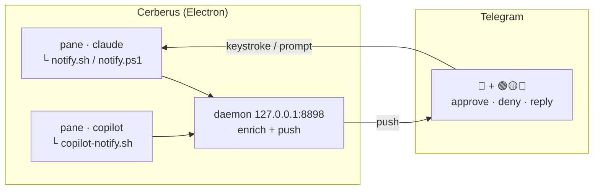

<div align="center">


**A GUI terminal multiplexer with remote control** — split panes with the mouse or tmux-style keys and run whatever you like in each one: Claude Code, Copilot CLI, Codex, opencode, aider, a plain shell. Read the project's markdown right there in the pane, and when an AI session needs you, approve, deny or prompt it from your phone over Telegram, straight into the right pane.

<sub>native panes · no tmux · project docs in-app · permission prompts · risk-tagged commands · tabs · session restore · light/dark</sub>


[Install](#install) · [First run](#first-run) · [Controls](#controls) · [Docs in the pane](#your-projects-docs-in-the-pane) · [From your phone](#from-your-phone) · [Config](#per-project-config) · [Contributing](#contributing)


</div>

> Your company won't enable remote control? No problem — Cerberus is your
> three-headed guard dog, and it works the night shift for free. 🐕‍🦺

A multiplexer first: native panes, no tmux, every pane a pty Cerberus owns — and
whatever you'd type in a terminal runs in one. Claude Code in this pane, Copilot
CLI in that one, Codex, opencode, aider, a plain shell, a build watcher.

Every pane also carries its project's documentation. The document button lists
the markdown of whatever project that pane sits in and renders it over the
terminal — no browser, no second window, and the session underneath keeps
running. See [your project's docs, in the pane](#your-projects-docs-in-the-pane).

Then the remote half. When an AI session needs you — a permission prompt, waiting
for input — it pushes a Telegram notification. From your phone you
**approve / deny**, or **type a prompt** that lands in the right pane. Every
pending command is tagged with a risk icon 🟢 🟡 🔴 so you know what you're
approving. Approve something remotely and the result is pushed back to you. Which
agents can push, on which OS, is in [what pushes where](#what-pushes-where).

<div align="center">

</div>


```mermaid
flowchart LR
    subgraph app["Cerberus (Electron)"]
        A["pane · claude<br/>└ notify.sh / notify.ps1"]
        B["pane · copilot<br/>└ copilot-notify.sh"]
        D["daemon 127.0.0.1:8898<br/>enrich + push"]
        A --> D
        B --> D
    end
    subgraph tg["Telegram"]
        T["🔔 + 🟢🟡🔴<br/>approve · deny · reply"]
    end
    D -->|push| T
    T -->|"keystroke / prompt"| A
```

## Install

### macOS and Linux — one line

```bash
curl -fsSL https://raw.githubusercontent.com/leodudedev/cerberus-term/main/install.sh | sh
```

Installs `Cerberus.app` into `/Applications` on macOS, or the AppImage into
`~/.local/share/cerberus-term` plus a menu entry on Linux. Run the same command
again to update; the script checks the SHA-256 of what it downloads against the
`SHA256SUMS-*.txt` published with the release, and refuses to touch an install
while the app is running.

Read it first if you'd rather — it's [`install.sh`](install.sh) in this repo, and
`--version X.Y.Z` pins a specific release.

### Manual download

| OS | File |
|----|------|
| macOS (Apple Silicon) | [`Cerberus-mac-arm64.dmg`](https://github.com/leodudedev/cerberus-term/releases/latest/download/Cerberus-mac-arm64.dmg) |
| Windows | [`Cerberus-win-x64.exe`](https://github.com/leodudedev/cerberus-term/releases/latest/download/Cerberus-win-x64.exe) |
| Linux (Debian/Ubuntu) | [`Cerberus-linux-amd64.deb`](https://github.com/leodudedev/cerberus-term/releases/latest/download/Cerberus-linux-amd64.deb) |
| Linux (any distro) | [`Cerberus-linux-x86_64.AppImage`](https://github.com/leodudedev/cerberus-term/releases/latest/download/Cerberus-linux-x86_64.AppImage) |

Or see all assets on the [releases page](https://github.com/leodudedev/cerberus-term/releases/latest).

> Builds aren't signed or notarized yet, and a **browser** download is what
> attaches the Gatekeeper quarantine that makes **macOS** call the app
> "damaged". Clear it once, then open normally:
> ```bash
> xattr -cr /Applications/Cerberus.app
> ```
> On macOS 15 and later, "Open Anyway" lives in System Settings → Privacy &
> Security; the old right-click → Open no longer works. The install script above
> sidesteps all of this, because `curl` doesn't set the quarantine flag.
>
> **Windows**: dismiss the SmartScreen prompt — there's no equivalent shortcut
> there. Signing and notarization are on the list.

## Requirements

- **macOS, Windows, or Linux.** Panes are native on all three — ConPTY on
  Windows, a pty elsewhere — so **anything** runs in a pane: Claude Code, Copilot
  CLI, Codex, opencode, aider, a shell, `htop`, whatever you'd type in a
  terminal. The Telegram half is the part that varies, because it depends on each
  CLI's own hook support: see [what pushes where](#what-pushes-where).
- **An AI CLI** in your `PATH`. [Claude Code](https://claude.com/claude-code) and
  [GitHub Copilot CLI](https://github.com/github/copilot-cli) push out of the
  box: Cerberus offers to register its notification hooks in their config the
  first time you open it, and writes to nothing you don't tick — see
  [what the app writes](#what-the-app-writes-outside-itself) for exactly what
  changes. Any other CLI still runs in a pane; it just won't push.
- **A Telegram bot** for the remote half: talk to
  [@BotFather](https://t.me/BotFather) for a token, and to
  [@userinfobot](https://t.me/userinfobot) for your chat ID. Without them
  Cerberus is a plain multiplexer — nothing is pushed anywhere.

### What pushes where

Panes work the same everywhere. What follows is only about the Telegram half, and
it says what has actually been exercised rather than what ought to work.

| | Panes | Claude Code → Telegram | Copilot CLI → Telegram |
| --- | --- | --- | --- |
| **macOS** | tested | tested | tested |
| **Windows 10/11** | tested | tested since 0.10.0 | not offered |
| **Linux** | tested headless, GUI not | plumbing tested, real CLI not | plumbing tested, real CLI not |

- **Windows** got the hooks in 0.10.0, on a physical machine: consent, the four
  Claude Code events, notifications, remote approve/deny, and the guard that
  refuses to type into `ssh`. Copilot CLI is deliberately left out — see
  [below](#what-the-app-writes-outside-itself).
- **Linux** is the honest gap. In a container the daemon, the registry, the pty
  seam, the guard and both hook scripts pass on a real Linux pty. What nobody has
  done yet is run the app's window on a Linux desktop, or drive a real
  `claude`/`copilot` there — the code path is the same POSIX one macOS uses, so
  this is unverified rather than doubtful. Reports welcome.

## First run

1. Open the app. It asks, once, which agent CLIs may have their notification
   hooks registered, naming the file it would edit for each. Ticking none is a
   valid answer and is remembered; Settings can change it later.
2. **Cmd+,** (or menu → **Settings…**) → set your Telegram **bot token** and
   **chat ID**, and pick the bot's language (English or Italian). Restart the app
   so the bot starts polling with the new token.
3. In any pane run `claude`. When the session needs you, you get a Telegram push
   with 🟢 🟡 🔴 risk and Approve / Deny / prompt buttons that land in that pane.

### What the app writes outside itself

Two places, and nothing else:

**1. `~/.cerberus-term/hooks/`** — `notify.sh` and `copilot-notify.sh` on macOS
and Linux, `notify.ps1` on Windows, copied here from the app bundle on every
launch, overwriting the previous copies. This
directory is the stable home for them: hooks run in *every* session of that CLI,
including ones outside Cerberus, so a path pointing inside the `.app` would break
them all the day you move or delete it.

**2. The config of the agent CLIs you tick** — currently `~/.claude/settings.json`
and `~/.copilot/settings.json`. Nothing is written to either until you say so:
the first launch shows a dialog listing the agents found on this machine, the
exact file and events for each, and you choose. Decline and the answer is
remembered — you won't be asked again, and nothing outside the app is touched.

An agent is only offered if its config folder already exists. If you don't have
Copilot, `~/.copilot` is never created, and the same goes for `~/.claude`.
Settings lists every file by name with its real state, and is where you change
your mind later — including for an agent you install afterwards, which shows up
there unticked rather than being enabled on your behalf.

Entries are **appended**, in each CLI's own shape. Claude Code, under
`PreToolUse`, `PostToolUse`, `Notification` and `SessionEnd`:

```json
{ "matcher": "", "hooks": [{ "type": "command", "command": "/Users/you/.cerberus-term/hooks/notify.sh" }] }
```

Copilot CLI, under `preToolUse`, `notification` and `agentStop`:

```json
{ "type": "command", "bash": "/Users/you/.cerberus-term/hooks/copilot-notify.sh", "timeoutSec": 5 }
```

On Windows the same Claude Code entry reads the PowerShell script and runs it in
the shell the CLI already started, which is both faster than spawning a second
PowerShell and immune to the execution policy that blocks script files by
default there:

```json
{ "matcher": "", "hooks": [{ "type": "command", "command": "Invoke-Expression (Get-Content -Raw 'C:\\Users\\you\\.cerberus-term\\hooks\\notify.ps1')" }] }
```

Copilot CLI is not offered on Windows. The field it registers into is called
`bash`, and nobody has measured what runs that value there — a PowerShell line in
a field that turns out to be literally bash would fail on every tool call. Claude
Code's `command` field *was* measured: it goes through PowerShell. Until that one
experiment is done, the target is excluded rather than guessed at.

Nothing else in those files is touched — your model, your permissions, and any
hooks you or another tool registered stay exactly as they are, and ours is added
next to them rather than over them. Before the first write the whole file is
copied to `settings.json.cerberus-bak`, and the write itself goes through a temp
file and a rename, so an interrupted launch can't truncate it. Re-running is a
no-op once the entry is there.

Outside a Cerberus pane the scripts exit immediately — they're gated on
`CERBERUS_PANE_ID`, which only our panes set — so a `claude` in VS Code or a
plain terminal is unaffected.

**To opt out later:** untick the agent under **Agent CLI hooks** in Settings.
That removes our entries from that file right away and stops re-adding them at
launch; a tickbox is needed rather than a one-off button because otherwise the
next start would just put them back. Or restore the `.cerberus-bak` files by
hand.

Without the hooks the app is still a working terminal multiplexer; what you lose
is everything that depends on a session reporting back — the pane flash on a
permission prompt, and the Telegram push.

## Controls

| Action | Mouse / button | Keyboard |
|--------|----------------|----------|
| Split right / down | the split buttons in the pane header | `Ctrl+B` then `%` / `"` (or Cmd+D / Cmd+Shift+D) |
| Kill pane | the close button, or right-click the pane | `Ctrl+B` then `x` (or Cmd+K) |
| Zoom pane to the whole tab | the expand button | `Ctrl+B` then `z` |
| Focus pane | click | `Ctrl+B` then `h/j/k/l` or arrows |
| Resize | drag the divider | `Ctrl+B` then `H/J/K/L` |
| New / close tab | `+` / `✕` in the tab bar | `Cmd+T` / `Cmd+W` |
| Next / previous tab | click the tab | `Cmd+Shift+]` / `Cmd+Shift+[` |
| Jump to tab 1–9 | click the tab | `Cmd+1` … `Cmd+9` |
| Star this pane's cwd | the star button, or right-click the pane | — |
| Jump to a favorite | the heart button, or right-click the pane | — |
| Read the project's markdown | the document button in the pane header | ↑ ↓ and Enter in the list, Esc to close |
| Clear a pane's buffer | right-click the pane | — |
| Edit `.cerberus.json` | the sliders button in the pane header | — |
| Mute every Telegram push | ✈ at the right of the tab bar | — |
| Copy / paste | — | `Cmd+C` / `Cmd+V` (`Ctrl+Shift+C` / `Ctrl+Shift+V`) |
| Find in pane | menu → Edit → Find… | `Cmd+F` (`Ctrl+Shift+F`) |
| Find in the open document | the find button in the viewer bar | `Cmd+F` (`Ctrl+Shift+F`) |
| Stop loading a document's remote images | the globe button in the viewer bar | — |
| Newline without submitting | — | `Shift+Enter` |
| Settings | menu → Settings… | `Cmd+,` |
| Toggle theme | menu → View → Toggle Theme | `Cmd+Shift+L` |
| Keyboard shortcuts | `?` at the right of the tab bar, or menu → Help | `Cmd+/` (`Ctrl+Shift+/`), or `Ctrl+B` then `?` |

Where two keys are listed, the second is Windows/Linux: `Ctrl+C`, `Ctrl+F` and
friends are control characters the shell owns, so those bindings move to
`Ctrl+Shift`. The `Ctrl+B` leader arms for two seconds; Esc cancels it.

The `?` panel is the complete list, resolved for the machine it's opened on, and
it carries a few bindings this table leaves out — split aliases, arrow resizing,
window and fullscreen keys.

Find searches the focused pane's scrollback: Enter and Shift+Enter walk the
matches, `Aa` and `.*` toggle case sensitivity and regex, Esc closes.

**The document button reads the docs without leaving the pane** — see
[your project's docs, in the pane](#your-projects-docs-in-the-pane).

Dropping files onto a pane types their absolute paths into the session.

The layout, per-pane cwds, tabs, favorites, and theme are restored on relaunch.
Panes also survive a window reload — the shells keep running and reattach.

### Leftover processes

Closing a pane kills its shell, and the hangup takes down whatever was running
in the foreground with it. What it can't take down is anything detached from
that shell — a `nohup`ed build, a `disown`ed job, a dev server started with `&`
in a pane you closed hours ago. Those keep running after the app is gone.

So on quit Cerberus looks: it notes what the panes were running, kills the
ptys, and a moment later checks who is still alive. Survivors are listed by
name and pid, and you decide — **Leave running** or **Terminate** (SIGTERM,
then SIGKILL for whoever ignores it). Tick *Always do this* to stop being
asked, or set it up front under **Leftover processes on quit** in Settings:
ask, terminate, or leave.

Real daemons are out of scope. A process that called `setsid` or double-forked
went out of its way to outlive its terminal, so it's left alone.

### Do not disturb

The ✈ button at the right of the tab bar is a global do-not-disturb: while the
plane shows crossed out, no session pushes to Telegram, so you can work at the
keyboard undisturbed, and one click restores every session at once when you walk
away. Clicking it opens a dialog spelling out what changes and what doesn't.

It's independent of the per-project `mute` and of `/mute` from the chat —
turning it off leaves those exactly as they were. Panes still flash locally when
a session asks for a permission, and the state survives a restart. Without a bot
token and chat ID the button is dimmed and inert; set them in Settings and it
wakes up without a restart.

## Your project's docs, in the pane

The document button in a pane header lists the markdown of the project that pane
is sitting in — the repo root plus whatever folders you configure (`docs/`,
`doc/`, `documenti/`, `.claude/` by default), most recently touched first, with
`CLAUDE.md`, `AGENTS.md` and `README.md` pinned on top. Type to filter, arrows
and Enter to pick.

The document opens over the pane: headings, tables, syntax-highlighted code and
mermaid diagrams, in the app's own light/dark palette. `Cmd+F` searches inside
it, links between documents are followed in place with a back button, the expand
button takes it to the whole window, and Esc drops you back to the CLI.

The pane is never resized while a document is open, so whatever TUI is running
underneath never redraws — reading the spec doesn't disturb the agent working
against it. Nothing outside the project root is ever listed or read, and a
document's own screenshots are inlined from disk rather than fetched.

Images a document points at over the network — a README's badge row — are
pulled by the app outside the browser session, so no cookie of yours goes out
with them, over https only and capped in size and time. The globe button in the
viewer bar turns that off per machine, and remote images fall back to chips
carrying their alt text.

## From your phone

Each notification carries the session, the risk icon, and the pending command:

| Button | What it does |
|--------|--------------|
| ✅ Approve | accepts this one prompt |
| ♾️ Always | accepts, and stops asking for that tool in this session |
| ❌ Deny | sends Escape, cancelling the pending action |

Anything you type in the chat is forwarded to a session as a prompt: **reply** to
a notification to target that session, or send a bare message to reach the most
recent one. Slash commands the bot doesn't own (`/model`, `/compact`, …) are
forwarded to the CLI verbatim.

The bot's own commands:

| Command | Effect |
|---------|--------|
| `/mute [duration]` | mute the targeted project — `/mute 2h`, or no argument for indefinitely |
| `/unmute` | unmute the targeted project |
| `/muted` | list muted projects and when they come back |

Bot-facing text is available in English and Italian (Settings → language, or
`CERBERUS_LANG=it`). Text coming from the CLI itself is passed through untouched,
in whatever language the session speaks.

## Per-project config

Drop a `.cerberus.json` in a project (edit it via the pane's ⚙ gear) to override
the global settings for sessions running there. It's picked up from the pane's
cwd or any directory above it:

| Key | Meaning |
|-----|---------|
| `mute` | silence notifications for this project |
| `chatId` | route its pushes to a different Telegram chat |
| `minRisk` | only notify at/above this risk (`safe` \| `caution` \| `danger`) |
| `notifyIdle` | set to `false` to notify only on permissions, never on waiting-for-input |
| `docs.globs` | folders the document list scans, relative to the project root (replaces the global list) |

## Security

The daemon binds **loopback only** (`127.0.0.1`) and is token-gated; Telegram
callbacks are checked against your allowed chat(s); CLI hooks are gated on
`CERBERUS_PANE_ID`, so they fire only inside a Cerberus pane and coexist with any
tmux-based setup. Your bot token and session state are stored in **plaintext**,
like a `.env` — anyone with access to your user account can read them.

Full threat model, what the token gate does and does not defend against, and how
to report a vulnerability: [SECURITY.md](SECURITY.md).

## Development

```bash
pnpm install     # postinstall rebuilds node-pty for the Electron ABI
pnpm dev         # launch the app (HMR)
pnpm typecheck
pnpm test        # vitest, unit tests over src/core + the pure renderer modules
```

Tests live in `tests/` and cover the Electron-free logic — risk classification,
escape-sequence stripping, permission-dialog parsing, the pane tree, and the
workspace snapshot migrations. `typecheck` and `test` both run in CI.

Build installers locally:

```bash
pnpm run dist          # current OS
pnpm run dist:mac      # / dist:win / dist:linux
```

> Use `pnpm run pack`/`dist`, not `pnpm pack`/`dist` — `pack` collides with a
> pnpm builtin.

## Experimental: orchestration cockpit

> ⚗️ **Early-stage.** The APIs work but are young and may change.

Beyond supervising single sessions, Cerberus can act as a **cockpit for
multi-session orchestration**: one interactive session drives a queue of headless
workers, each worker streams live into a read-only follower pane that auto-tiles
into a grid, and the human gates (merge/push approvals) still arrive on your
phone. Workers run with `CERBERUS_PANE_ID` unset so they never notify — only the
orchestrator does.

The orchestrator is agent-agnostic: each task carries its own command, so you can
mix Claude, Copilot, and plain scripts in one queue.

**→ [`examples/`](examples/README.md)** has the full walkthrough plus
[`orchestrate.sh`](examples/orchestrate.sh), a minimal crash-resumable driver you
can copy into a project and run.

## Stack

Electron · xterm.js · node-pty · TypeScript · electron-vite · electron-builder ·
grammY (Telegram). The backend sits behind a thin `TerminalBridge` seam, so a
future Tauri/Rust swap is a module replacement, not a rewrite.

## Contributing

Issues and pull requests are welcome — bug reports, platform quirks (Windows and
Linux especially), and hooks for other AI CLIs are all useful. See
[CONTRIBUTING.md](CONTRIBUTING.md) for setup, conventions, and how releases work.

Release notes live in [CHANGELOG.md](CHANGELOG.md).

## License

MIT — see [LICENSE](LICENSE).
